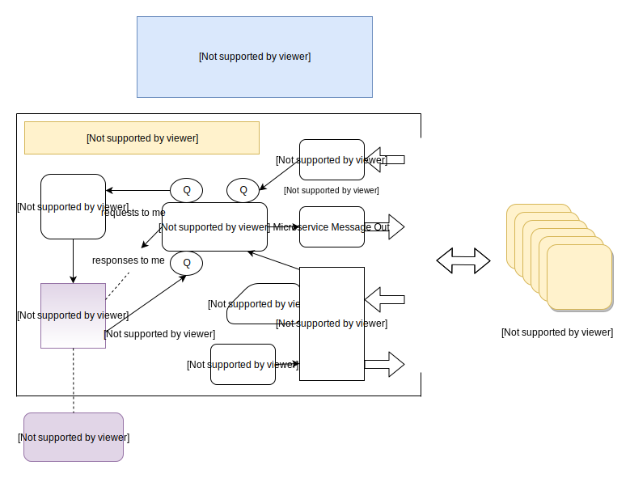

# noqms
NoQMS - No Queue Microservices - Java Framework

Microservices without a centralized queue is a perfectly viable architecture given there is 
an efficient way for the microservices to discover each other. UDP multicast is a great solution for
this. UDP multicast is supported by Linode and Digital Ocean, for example, but not by the other major
cloud providers. For the others, this framework includes a pluggable Service Finder which allows developers 
to create their own discovery mechanism and class, replacing the built in UDP multicast service finder if 
needed. A unicast implementation of this ([unicast service finder](https://github.com/noqms/noqms-finder-unicast)) 
is now available as well as the required accompanying server ([unicast service finder server](https://github.com/noqms/noqms-finder-unicast-server)) for use in those environments that do not support UDP multicast. Running in an environment without 
UDP multicast somewhat reduces the attractiveness of NoQMS which otherwise requires no other running process 
to accommodate a microservice system.

I coined the term NoQMS - No Queue Microservices - to describe microservices with no dependency on
a centralized queue.

This Java implementation of the NoQMS architecture shown above is lean and mean - the central
processor itself is a single thread with no dependencies on blocking processes. 

Your microservice code runs in as many configurable threads as you want.
This allows you to adjust to better take advantage of the (virtual) environment's resources such as CPU and memory. 
Outside of the single (potentially multi-threaded) microservice instance, the framework supports discovering and
utilizing all microservice instances (running, ideally, on virtual environments of their own) 
that are making their presence and availability known. This yields scalability and also better reliability in the event 
of failure as you would expect. A NoQMS microservice can also run within a container orchestration system
and benefit from all the goodies that brings just like traditional microservices. 

UDP unicast is an excellent choice for the application level inter microservice messages. Developers should not
dismiss UDP offhand. Utilized correctly, it scales far beyond TCP for obvious reasons. UDP is very reliable
when there the receiving end is processing the data in a timely fashion. One downside of UDP includes 
single packet limits of under 64K. So write your microservices accordingly, thinking carefully about not turning it 
into a <i>macro</i>service before applying workarounds (paging, application level packet reassembly, etc) for that limit. 
Additionally, in the event of transmission failure, we know that we must program for failure anyway in order to have a 
robust system. Timeouts are an integral part of the NoQMS framework, covered next.

Timeouts are first class citizens in this architecture. With each microservice the application developer specifies the
typicalMillis and the timeoutMillis for that microservices. The framework handles the rest - notifying a requester when
a response has timed out, for example. Waiting for a response will not take longer than the receiving side's reported
timeout, and the response information indicates whether a timeout occured. The microservice can handle the timeout 
if the way to handle it at its level is clear, or simply pass it up the chain, sending an application defined status code back 
to the microservice that requested the data from <i>it</i>.  Programming for and explicity handling more failure cases - which includes timeouts - makes for a more robust system. The alternative can sometimes mean long weekends for IT and fixing or recovering data
because of an unforeseen slowdown somewhere in the system that caused cascading failures. 

One benefit of not having a centralized queue - and of the framework being capable of instantiation any number of
microservices locally and within the same process (not the intended production scenario) - is that the development 
and debugging phase is now nearly back to "not harder" than traditional architectures. The examples and tests demonstrate how 
to run one or more microservices from an external process. 

[Examples](https://github.com/noqms/noqms-examples) and [Tests](https://github.com/noqms/noqms-tests) for this framework
reside in sibling projects.

To run noqms:

* Install Java 12 or greater
* Put all of the noqms release files and dependencies in a directory as well as your microservice jar
* cd to that directory
* java -server -cp **xCPx** com.noqms.Runner **key/value arguments**

**xCPx** is *;. for Windows and *:. for Linux

**key/value arguments** are in the form of key=value (like groupName=A serviceName=B) and include the following:

     * groupName                 name of your group of interconnected microservices - must be the same between
     *                           microservices intended to communicate with each other
     * 
     * serviceName               microservice name - must be unique among interconnected microservice types -
     *                           instances of the same microservice type have the same microservice name
     * 
     * servicePath               com.x.x.x full path of your microservice - can reside anywhere on your classpath
     * 
     * threads                   number of threads simultaneously executing your microservice code - increase to
     *                           fully utilize your resources (cpu/memory/disk) - consider 10s or 100s per core
     * 
     * typicalMillis             typical execution time of your microservice under normal circumstances - the
     *                           back pressure threshold is roughly determined by threads * (timeoutMillis /
     *                           typicalMillis)
     * 
     * timeoutMillis             time after which unanswered requests to your microservice are considered failed
     *                           for whatever reason - the back pressure threshold is roughly determined by
     *                           threads * (timeoutMillis / typicalMillis)
     * 
     * maxMessageOutBytes        max bytes for outgoing messages from your microservice, including both requests
     *                           and responses from you
     * 
     * maxMessageInBytes         max bytes for incoming messages to your microservice, including both requests
     *                           and responses to you
     * 
     * emitterIntervalSeconds    default=2 - interval that microservice info is broadcast - must be the same
     *                           between interconnected microservices
     * 
     * serviceUnavailableSeconds default=5 - interval after which a microservice is considered dead or
     *                           unavailable if microservice info has not been received for it - must be the same
     *                           between interconnected microservices
     * 
     * serviceFinderPath         default="com.noqms.finder.multicast.ServiceFinderMulticast" - the full path of a
     *                           pluggable microservice discovery mechanism - can be anywhere on your classpath
     * 
     * logListenerPath           the full path of an optional listener for external log message processing - can
     *                           be anywhere on your classpath
     *
     * dataPort                  default=any available - UDP port the framework reads for incoming microservice
     *                           application data - this is broadcast automatically by the framework
     
