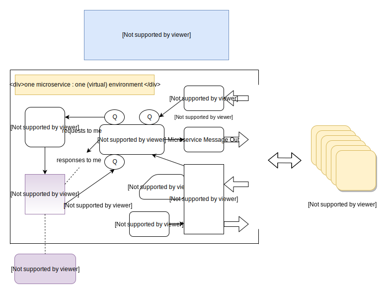

# noqms
NoQMS - No Queue Microservices - Java Framework

Microservices without a centralized queue is a perfectly viable architecture given there is 
an efficient way for the microservices to discover each other. UDP multicast is a perfect solution for
this - unfortunately most cloud providers do not support UDP multicast. This framework includes a pluggable
Service Finder mechanism which allows users to create their own discovery mechanism and class, replacing 
the built in UDP multicast discovery mechanism if needed.

The Java framework here is built to be lean and mean - the central processor itself is a single thread with no 
dependencies on blocking processes. 

You microservice code itself is isolated and runs in as many configurable threads as you want.
This allows you to adjust to better take advantage of the (virtual) environment's resources such as CPU and memory. 
Outside of the single microservice instance, the framework supports running as many instances of a unique
microservice as you like (ideally, on other virtual environments) for overall scalability and to achieve better
reliability in the event of failure. There should always be more microservice instances of any unique microservice 
that what is required for full load. So there should always be at least 2 of each unique microservice.

UDP unicast is an excellent choice for the inter microservice messages. Developers need to be wiser about dismissing
UDP offhand. Utilized correctly, it scales far beyond TCP for obvious reasons. We must never dismiss 
the actuality of just how reliable UDP can be when there is, in fact, something on the other side receiving 
the data in a timely fashion. The downside of UDP includes single packet limits of under 64K. So write your 
microservices accordingly, thinking carefully about not turning it into a macroservice before applying 
workarounds for that 64K limit (paging, application level packet reassembly, etc).

Timeouts are first class citizens in this architecture. With each microservice the application developer specifies the
typical time and the timeout time for that microservices. The framework handles the rest - notifying a requester when
a response has timed out, for example. Waiting for a response will not take longer than the receiving side's reported
timeout. Programming for and explicity handling failure cases - which includes timeouts - makes for 
a more robust system.
